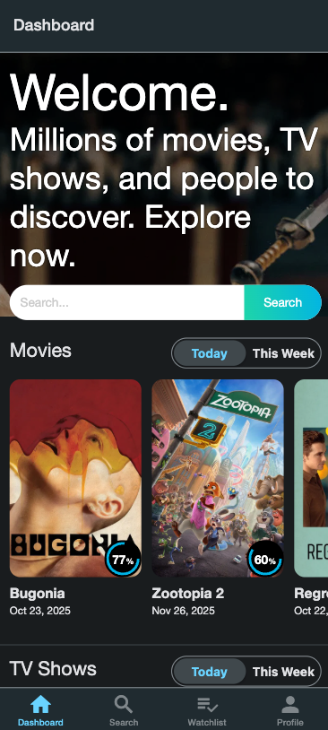
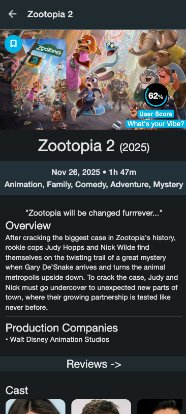
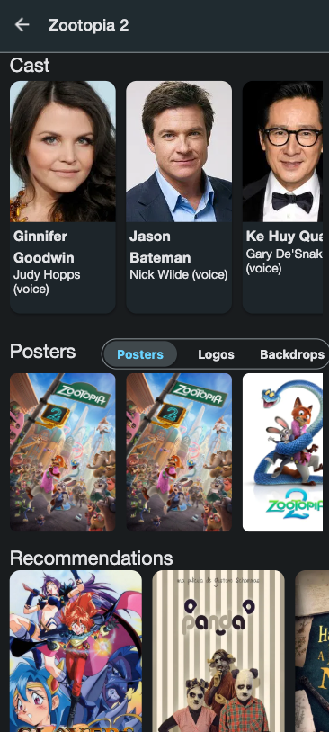
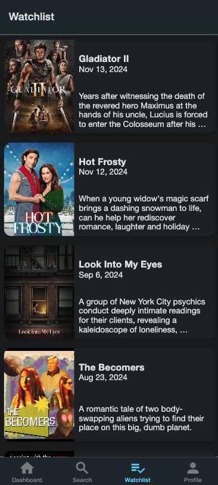

# 🎬 The Movie DB App

<div align="center">

A modern, feature-rich movie discovery application built with React Native and Expo. Explore millions of movies and TV shows, manage your watchlist, and stay updated with the latest trending content.

**[Features](#-features) • [Screenshots](#-screenshots) • [Tech Stack](#-tech-stack) • [Getting Started](#-getting-started) • [Configuration](#-configuration)**

</div>

---

## ✨ Features

### 🎯 Core Functionality
- **🔥 Trending Dashboard** - Discover the latest trending movies and TV shows
- **🔍 Advanced Search** - Find any movie or show with powerful search capabilities
- **📝 Detailed Information** - View comprehensive movie details, cast, posters, and reviews
- **⭐ User Ratings** - See user scores and community ratings at a glance
- **📚 Watchlist Management** - Save movies to your personal watchlist for later viewing
- **👤 User Profile** - Manage your account and preferences

### 🎨 User Experience
- **📱 Cross-Platform** - Seamlessly runs on iOS, Android, and Web
- **🌙 Dark Mode UI** - Beautiful, modern dark theme interface
- **⚡ Fast & Responsive** - Optimized performance with smooth animations
- **💾 Offline Persistence** - Your watchlist and preferences are saved locally

---

## 📸 Screenshots

<div align="center">
  <table>
    <thead>
      <tr>
        <th align="center">Dashboard</th>
        <th align="center">Movie Details</th>
        <th align="center">Cast & Posters</th>
        <th align="center">Watchlist</th>
      </tr>
    </thead>
    <tbody>
      <tr>
        <td align="center">
          
        </td>
        <td align="center">
          
        </td>
        <td align="center">
          
        </td>
        <td align="center">
          
        </td>
      </tr>
      <tr>
        <td align="center">Browse trending movies and TV shows</td>
        <td align="center">View comprehensive movie information</td>
        <td align="center">Explore cast members and posters</td>
        <td align="center">Manage your saved movies</td>
      </tr>
    </tbody>
  </table>
</div>

---

## 🛠️ Tech Stack

### Core Technologies
- **[Expo](https://expo.dev/)** - Universal React Native framework
- **[React Native](https://reactnative.dev/)** - Cross-platform mobile development
- **[TypeScript](https://www.typescriptlang.org/)** - Type-safe JavaScript

### Key Libraries & Tools

| Package | Purpose |
|---------|---------|
| **[Expo Router](https://expo.github.io/router/docs)** | File-based navigation system |
| **[React Native Paper](https://callstack.github.io/react-native-paper/)** | Material Design UI components |
| **[Redux Toolkit](https://redux-toolkit.js.org/)** | State management solution |
| **[Redux Persist](https://github.com/rt2zz/redux-persist)** | Persistent state storage |
| **[Axios](https://axios-http.com/)** | HTTP client for API requests |
| **[Luxon](https://moment.github.io/luxon/)** | Modern date/time handling |

---

## 🚀 Getting Started

### Prerequisites
- Node.js (v16 or higher)
- npm or yarn
- Expo CLI (optional, but recommended)

### Installation

1. **Clone the repository**
   ```bash
   git clone https://github.com/yahyabagia/the-movie-db.git
   cd the-movie-db
   ```

2. **Install dependencies**
   ```bash
   yarn install
   # or
   npm install
   ```

3. **Configure environment variables** (see [Configuration](#-configuration) below)

4. **Start the development server**
   ```bash
   yarn start
   # or
   npm start
   ```

5. **Launch on your preferred platform**
   - **iOS**: Press `i` in the terminal (requires macOS)
   - **Android**: Press `a` in the terminal (requires Android Studio/emulator)
   - **Web**: Press `w` in the terminal

---

## ⚙️ Configuration

### Environment Setup

Create a `.env` file in the root directory with your TMDB API credentials:

```bash
EXPO_PUBLIC_TMDB_API_BASE_URL=https://api.themoviedb.org/3
EXPO_PUBLIC_TMDB_API_KEY=<YOUR_API_KEY>
EXPO_PUBLIC_TMDB_API_TOKEN=<YOUR_API_TOKEN>
```

> [!IMPORTANT]
> You need to obtain API credentials from [The Movie Database (TMDB)](https://www.themoviedb.org/settings/api) to use this app.

### Getting TMDB API Credentials

1. Create a free account at [TMDB](https://www.themoviedb.org/signup)
2. Navigate to **Settings** → **API**
3. Request an API key
4. Copy your API Key and API Read Access Token
5. Paste them into your `.env` file

---

## 🏗️ Architecture & Concepts

### State Management
The app uses **Redux Toolkit** for centralized state management with **Redux Persist** to maintain state across app sessions. This ensures your watchlist and user preferences are preserved even after closing the app.

### Custom Hooks
Modular, reusable logic is encapsulated in custom hooks for:
- Fetching movie data
- Managing watchlist operations
- Handling user interactions
- API request management

### Cross-Platform Support
Built with Expo's web compatibility, the app provides a consistent experience across mobile and web platforms without code duplication.

### Type Safety
TypeScript is used throughout the project to catch errors early and provide better developer experience with autocomplete and type checking.

---

## 📦 Project Structure

```
the-movie-db/
├── app/                    # Expo Router pages
├── components/             # Reusable UI components
├── hooks/                  # Custom React hooks
├── store/                  # Redux store configuration
├── services/               # API services and utilities
├── types/                  # TypeScript type definitions
└── .env                    # Environment variables (create this)
```

---

## 🎯 Key Features in Detail

### Watchlist Management
Utilize Redux and Axios to handle paginated watchlist data. Users can seamlessly add, view, and remove movies from their personal watchlist with real-time updates.

### Ratings Integration
Display user ratings with interactive UI components featuring circular progress indicators showing community scores at a glance.

### Date Formatting
Luxon ensures robust and user-friendly date formatting throughout the app (e.g., "Nov 26, 2025 • 1h 47m").

---

## 📄 License

This project is open source and available under the [MIT License](LICENSE).

---

## 👨‍💻 Author

**Yahya Bagia**
- GitHub: [@yahyabagia](https://github.com/yahyabagia)

---

<div align="center">

**Built with ❤️ using React Native and Expo**

⭐ Star this repo if you find it helpful!

</div>
